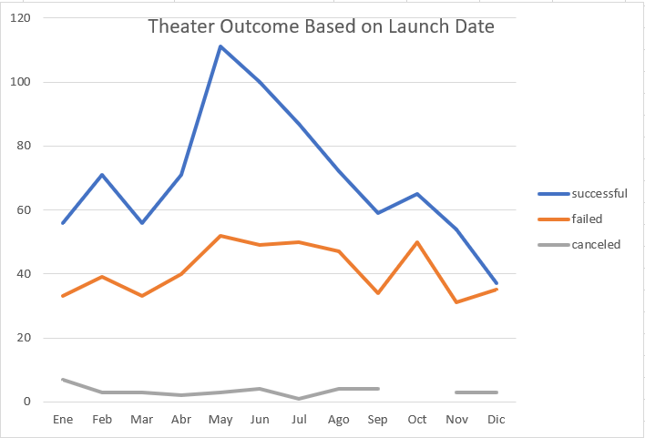
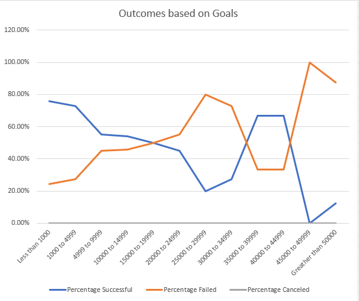

# Fundraising feasibility analysis for "Fever" movie

## Overview of Project

We have been requested to analyze probable outcomes of the forecoming fundraising according to the launch dates and funding goals.
This report has been prepared analyzing the information provided, that accounts for 1066 projects launched during the period 6/23/2015 to 10/27/2017.
The result of this analysis should be understand as a good advice related to **when and for how much the fundraising should be performed in order to increase the probability of success**, but up to the extension of the dataset mentioned. Which have several limitations detailed below.

### Purpose

The purpose of the project is to determine the best combination of month and amount that the project should have in order to maximize the chances of succeeding during the fundraising process.

## Analysis and Challenges

We have performed the requested analysis up to the extension requested but not exceeding the scope requested by Louise.
One important challenge is the quality of the information provided. The database contains information of fundraising performed in the period 2010 - 2017. Older years could be not representative of the current market environment and even the newer years are 4 years ago from when this fundraising is going to take place. Several macroeconomic conditions have change since 2017 that could have had an impact about the industry. Performing an analysis on a more updated database is desirable.

### Analysis of Outcomes Based on Launch Date

We have performed an analysis of the Theater's fundraising considering the month they were launch. Considering the information provided the probabilities of a successful fundraising is higher on May.
The chances of succeeding increase to **66.87%** when the average is 62.29% and the minimum is 56.52%. it is also the month when more fundraising take place with 12.13% of the overall. 
The following chart summarizes the situation:

  
 
### Analysis of Outcomes Based on Goals

Considering the size of the fundraising project we have structured an analysis based on ranges of the project goal:

* Less than 1000
* 1000 to 4999
* 4999 to 9999
* 10000 to 14999
* 15000 to 19999
* 20000 to 24999
* 25000 to 29999
* 30000 to 34999
* 35000 to 39999
* 40000 to 44999
* 45000 to 49999
* Greater than 50000

Under this analysis the higher successful rate is achieved on small project of less than 1000 where the successful rate is 75.81%, higher project has a higher failed rate. 
except for the range 35000 to 44999 where the "success" rate increase to 66.67% but over a limited number of projects, only 6 below 39999 and 3 higher than that figure.
We think that is not enough information to make a clear recommendation that on that range fundraising are more successful, so we believe that a more detailed analysis is needed to make a decision.
This graph explain that success vs fail rate per project band:

 

### Challenges and Difficulties Encountered

## Results

We have been requested to analyze and make conclusions about the best month to launch the fundraising of the project and the adequate size of it to be successful.

It is important to emphasize that the size and the age of the database are not the best, the dataset include only 4.115 fundraising project but only 25% of them are plays, that is our scope. In relation with the age as we have mentioned before, the latest register is from 2017.  

In relation with the adequate month, it is clear that most convenient month to start the fundraising is May. It is when most of the fundraising are launch and where the success ratio is higher. 
At any case it is important to mention that the success rate is only 9.10% higher than the annual average, but if there is not any inconvenient to start on that month it is recommendable to do that. 

In relationship with the goal of the project, it is quite clear that small project succeeds frequently that the larger one. But it is also important to mention that the dataset do not have enough cases above 15.000, and any conclusion on this topic could not be valid due to the lack of information. 

We would recommend analyzing the year of the fundraising campaigns since that would show that basically the dataset is for the period 2014-2016, since years after or before that period have only few cases reported. This makes the dataset even less reliable to make a decision.

